<p align="center">
  
</p>

<h1 align="center">Hey, I'm clez 👋</h1>

<p align="center">
  <strong>TypeScript-first product builder · AI-tooling tinkerer · self-hosting enthusiast · occasional timezone mystery</strong>
</p>

<p align="center">
  I turn ambitious ideas into useful software—usually late at night, often from a new country,<br />
  and almost certainly with coffee within reach.
</p>

<p align="center">
  <a href="https://github.com/clezcoding?tab=repositories"></a>
  <a href="https://github.com/open-gsd/gsd-core"></a>
  
</p>

<p align="center">
  
  
  
  
  
</p>

<p align="center">
  
</p>

---

## `whoami`

```text
$ whoami
clez — developer, product builder, professional rabbit-hole explorer

$ pwd
/somewhere/on/earth/with/wifi

$ focus
saas · ai agents · mcp · developer tools · self-hosting

$ uptime
sleep_schedule: beta
```

I build across the whole product stack: interfaces, APIs, databases, background jobs, authentication, integrations, deployment pipelines, and the operational tooling that keeps everything alive after launch.

Most of my commercial SaaS work lives in private repositories. The code may be private; the architecture decisions, deployment lessons, and debugging scars are very real.

My favorite projects sit where **product thinking**, **developer experience**, and **automation** overlap. I like difficult systems that feel simple to use—and tools that explain themselves when something goes wrong.

| Right now | My default answer |
|---|---|
| **Building** | Focused SaaS products and AI-native developer tools |
| **Exploring** | Context engineering, agent workflows, safer automation |
| **Running** | Docker, Coolify, Linux, APIs, too many terminals |
| **Working from** | Wherever the Wi-Fi completes the handshake |
| **Best hours** | Suspiciously close to 3AM |
| **Runtime dependency** | Coffee ☕ |

---

## The extremely short origin story 🧙‍♂️

Once, my math teacher told me:

> “You're too dumb to be successful.”

That left me with two sensible options:

1. Prove them wrong.
2. Become successful enough that nobody asks me to calculate anything without a computer.

So naturally, I became a developer.

The plan is going surprisingly well—although centering a `<div>` can still become a deeply personal experience.

What started as curiosity became a habit: understand the system, remove the repetitive work, make the dangerous parts explicit, and keep iterating until the rough idea behaves like a real product.

---

## What I build when I should probably be sleeping 🌙

### 🔐 Private SaaS products

Complete products rather than isolated features:

- Next.js and React interfaces with TypeScript end to end
- APIs, databases, validation, authentication, and permissions
- Dashboards, admin tools, workflows, and background jobs
- Third-party integrations and automation
- Deployment pipelines and self-hosted infrastructure
- Bugs that only appear in production on Friday evening

### 🤖 AI-native developer tools

MCP servers, model-routing profiles, context-engineering experiments, and agent workflows that connect models to useful systems.

Asking an AI to write a poem is fun. Asking it to diagnose infrastructure at 3AM is a lifestyle.

### 🏠 Self-hosted infrastructure

Deployment automation, diagnostics, lifecycle management, and safer operational tooling. I want infrastructure that gives people control without requiring a ceremonial sacrifice to the DevOps gods.

### 🪄 CLI experiences

Installers that install. Uninstallers that actually uninstall. Commands that are safe to rerun. Errors that tell you what happened and what to do next.

> “Something went wrong” is not an error message. It is a cry for help.

---

## Featured public work 🚀

<table>
  <tr>
    <td width="50%" valign="top">
      <h3><a href="https://github.com/clezcoding/awesome-coolify">🛰️ awesome-coolify-mcp</a></h3>
      <p><strong>Operate Coolify from your coding agent.</strong></p>
      <p>A community MCP server for discovering infrastructure, deploying workloads, following logs, diagnosing incidents, and running gated emergency operations across one or many Coolify instances.</p>
      <p>
        
        
        
      </p>
      <p><a href="https://clezcoding.github.io/awesome-coolify/install.html">Install configurator</a> · <a href="https://www.npmjs.com/package/awesome-coolify-mcp">npm</a></p>
    </td>
    <td width="50%" valign="top">
      <h3><a href="https://github.com/clezcoding/gsd-cursor">🧠 gsd-cursor</a></h3>
      <p><strong>Researched Cursor model routing for GSD Core.</strong></p>
      <p>Six phase-aware profiles with exact model IDs, local verification, safe installation, backups, and exact restore—without patching GSD Core.</p>
      <p>
        
        
        
      </p>
      <p><a href="https://github.com/clezcoding/gsd-cursor/releases/latest">Latest release</a> · <a href="https://github.com/clezcoding/gsd-cursor#quick-start">Quick start</a></p>
    </td>
  </tr>
  <tr>
    <td width="50%" valign="top">
      <h3><a href="https://github.com/clezcoding/better-token">🧪 better-token</a></h3>
      <p><strong>Deterministic context-compression research.</strong></p>
      <p>An early experiment in reducing coding-agent context without quietly turning important information into creative fan fiction. Laboratory conditions apply.</p>
      <p>
        
        
      </p>
      <p><a href="https://github.com/clezcoding/better-token">Enter the lab →</a></p>
    </td>
    <td width="50%" valign="top">
      <h3><a href="https://github.com/clezcoding/brag-for-cursor">🎬 brag-for-cursor</a></h3>
      <p><strong>Bring <code>/brag</code> to Cursor on macOS.</strong></p>
      <p>A one-command installer and clean uninstaller that handles the skill, its dependencies, project/global targets, health checks, and the setup details nobody wants as a side quest.</p>
      <p>
        
        
        
      </p>
      <p><a href="https://github.com/clezcoding/brag-for-cursor#install">Install guide →</a></p>
    </td>
  </tr>
</table>

<p align="center">
  <a href="https://github.com/clezcoding?tab=repositories"></a>
</p>

---

## The framework behind the chaos 🧠

A large part of how I research, plan, structure, and ship software is powered by **[GSD Core](https://github.com/open-gsd/gsd-core)**.

GSD keeps the creative idea tornado on speaking terms with production. It turns vague ambition into research, specifications, executable phases, verification, and—against all statistical expectations—shipped software.

Without structure, many ideas would still live in a folder named:

```text
final-project-v2-new-FINAL-this-one-really
```

My interpretation of the workflow:

```text
💡 Get an idea
🔍 Research everything
📝 Create a suspiciously detailed plan
💻 Build at 3AM
🧪 Discover an edge case nobody asked for
🔧 Fix it anyway
🚀 Ship
🌍 Change country
🔁 Repeat
```

Or, more accurately:

> **Git. Get distracted. Return at 3AM. Ship. Somehow Done.**

Thank you to everyone behind **[open-gsd](https://github.com/open-gsd)** for building the framework behind much of what I build. 💜

---

## My usual toolbox ⚙️

<p align="center">
  
</p>

| Area | Tools and interests |
|---|---|
| 🎨 **Frontend** | Next.js · React · TypeScript · accessible product interfaces |
| ⚙️ **Backend** | Node.js · APIs · PostgreSQL · validation · background jobs |
| 🔐 **Product foundations** | Authentication · permissions · data isolation · integrations |
| 🤖 **AI engineering** | MCP · agent workflows · model routing · context engineering |
| 🚢 **Infrastructure** | Docker · Coolify · Linux · CI/CD · self-hosting |
| 🪄 **Automation** | Shell · CLIs · installers · deployment workflows |
| ☕ **Runtime dependency** | Coffee |
| 🛌 **Known incompatibility** | Normal sleeping hours |

The stack changes when the problem demands it. Strong technical opinions are useful; installing a new framework because it became popular on Tuesday is slightly less useful.

---

## Engineering principles I keep returning to 🧭

> Make the difficult thing understandable.  
> Make the repeated thing automatic.  
> Make the dangerous thing explicit.  
> Make the error message useful.  
> Make the rollback path boring.

I like software that:

- can be installed without an ancient Stack Overflow answer;
- explains what went wrong and suggests a next step;
- is safe to run more than once;
- can be removed without an archaeological expedition;
- makes destructive actions obvious and deliberate;
- survives the journey from “works on my machine” to “works outside my timezone.”

---

## Currently exploring 🔭

```text
SaaS            → focused solutions to specific real-world problems
AI agents       → stronger context, safer actions, better workflows
MCP             → connecting models to systems that do useful work
Self-hosting    → ownership without unnecessary operational misery
Developer tools → less setup, clearer feedback, fewer surprises
Travel          → how unreliable hotel Wi-Fi can become
Sleep           → backlog
```

Near the top of the rabbit-hole queue:

- Cursor-native developer tooling
- phase-aware model selection and verification
- MCP infrastructure for self-hosted platforms
- deterministic context handling for coding agents
- private SaaS systems with maintainable operational foundations

---

<div align="center">

## Build useful things. Ship them. Keep them maintainable.

### And maybe sleep occasionally. Apparently that is important. 😴

Found something useful, spotted a bug, or want to compare notes?

<a href="https://github.com/clezcoding"></a>
<a href="https://github.com/clezcoding?tab=repositories"></a>

<br /><br />

<sub>Currently somewhere on Earth, probably debugging something that worked five minutes ago. 🌍💻</sub>

</div>
